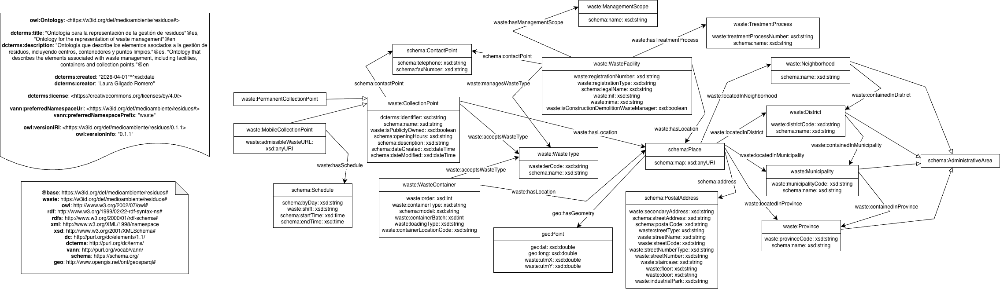

# Ontología para la representación de la gestión de residuos

Esta ontología describe elementos asociados a la gestión de residuos.

El modelo se ha construido a partir de datos abiertos publicados en datos.gob.es y proporcionados por distintas instituciones en el ámbito del medioambiente y los servicios públicos.

# Propósito y alcance de la ontología (purpose and scope of the ontology)

La ontología tiene como propósito representar información relativa a la gestión de residuos, incluyendo su tipología, su depósito en contenedores y puntos de recogida, su tratamiento en instalaciones y su localización, junto con otros aspectos relevantes.

El alcance de esta ontología se limita a la representación de datos de carácter administrativo y estructural. Quedan fuera del modelo, entre otros, elementos relativos a la gestión operativa o al funcionamiento detallado de los servicios, que podrían ser incorporados en futuras extensiones de la ontología.

# Prefijo y espacio de nombres (prefix and namespace)

El prefijo de esta ontología es waste. Se publica en el espacio de nombres: https://w3id.org/def/medioambiente/residuos#. 

# Modelo conceptual (ontology conceptualization)

# Estructura del repositorio (reposity structure)

El repositorio contiene las siguientes carpetas:

| Folder | Description |
|--------|--------------|
| **diagrams/** | Stores diagrams and other resources representing the conceptual model of the ontology (e.g., class hierarchies, relationships). |
| **documentation/** | Stores the HTML or human oriented documentation of the ontology and related artefacts. |
| **examples/** | Includes examples that demonstrate how to instantiate or apply the ontology in real data scenarios. |
| **kos/** | Stores controlled vocabularies or KOS implementation, usually SKOS implementations in rdf. |
| **ontology/** | Contains the actual ontology implementation files in formats such as `.owl`, `.rdf`, `.ttl`, or `.jsonld`. |
| **requirements/** | Contains all documents used to define the ontology’s requirements: data example, competency questions, functional requirements, use cases, etc. |
| **shapes/** | Contains the SHACL shapes used to define and validate ontology constraints. |

# Mantenimiento y evolución (maintenance and evolution)

Para gestionar las incidencias o mejoras sugeridas respecto a la ontología, recomendamos seguir las guías proporcionadas en [Issues Management](https://github.com/nombre-repositorio/wiki/issues-management) para generar una indicencia (trabajo en progreso).
